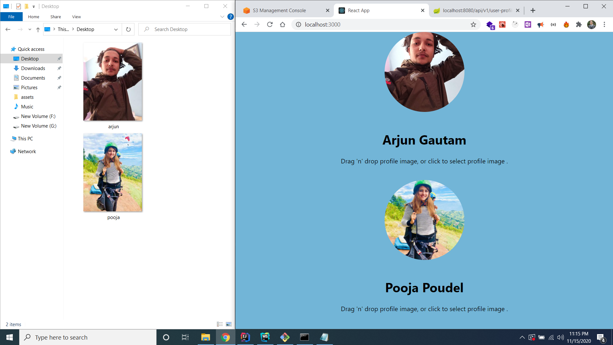
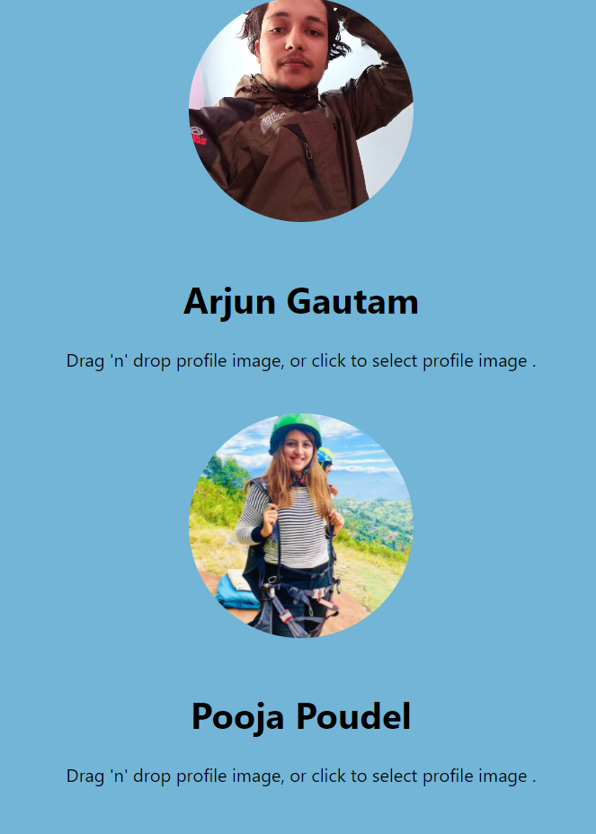
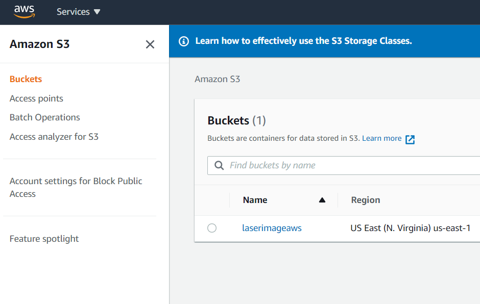
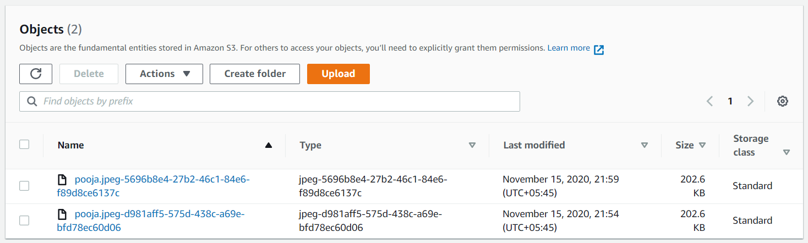

# AWS_Image_Upload
Image upload web applicatin using Spring Boot , React  and Amazon Web Services (S3 bucket).


# Upload Image 


# JSON
```json
// 20201116163107
// http://localhost:8080/api/v1/user-profile

[
  {
    "userProfileId": "d57bae24-f291-4547-98c1-07073d338415",
    "username": "Arjun Gautam",
    "userProfileImageLink": "arjun.jpg-65283b18-65a6-4325-8719-20ec8551c876"
  },
  {
    "userProfileId": "60f741a1-342e-43db-a7a6-b5ff524bc482",
    "username": "Pooja Poudel",
    "userProfileImageLink": "pooja.jpeg-18b29e12-4427-4bd9-b7af-18bd09aa62dc"
  }
]
``` 
# After you Upload image 


# S3 Bucket



